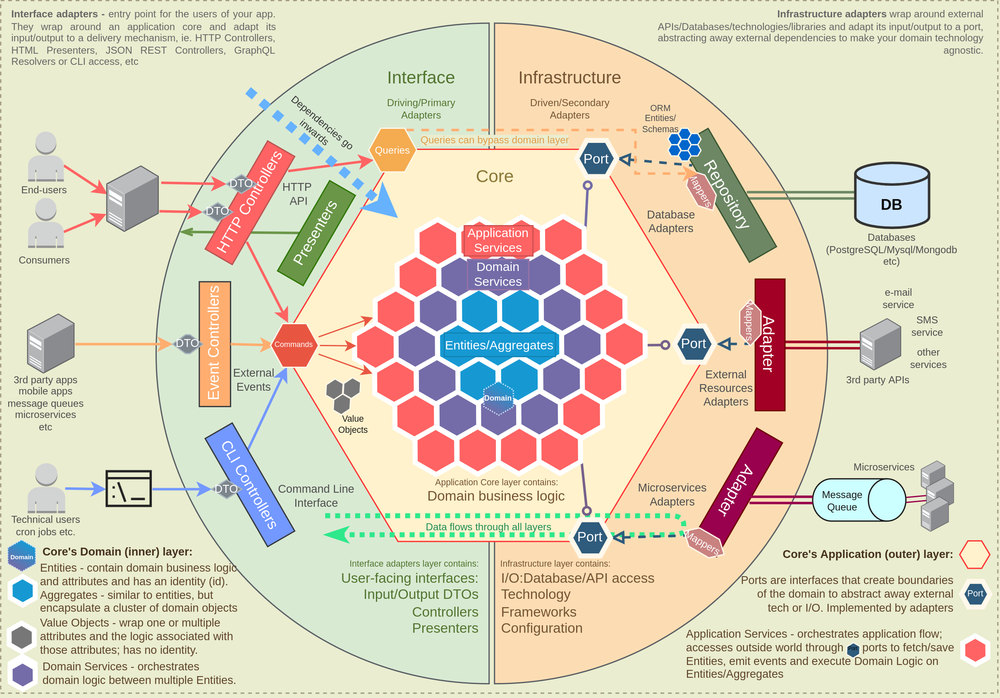

# Trading

TODO: insert badges here, test coverage, maintainability rating, CI/CD workflows statuses

This service represents the trading domain of the Algorythmix app. The primary responsibilities of the trading domain
is executing trades against 3rd-party systems and managing the history of trades.

### Table of contents
* [Technology](#technology)
* [Libraries](#libraries)
* [Architecture & Design](#architecture--design)
* [Setup](#setup)
* [Domain Analysis](#domain-analysis)

### Technology

- Python
- MongoDB
- Redis
- Kafka?

### Libraries

The requirements.txt file states the dependencies for the service.

### Architecture & Design

The design of the trading domain is based on the hexagonal architecture pattern. The benefits of applying this
design is improved testability, reduced coupling between application layers as well as between the application itself and
the infrastructure. The main trade-off is producing more boilerplate code. However, the project will be easier to scale and
test, and it will be a simpler process of replacing infrastructure technology.

The hexagonal architecture is visualized in the below diagram.



### Setup

```bash
pip install --upgrade pip \
&& pip install -r requirements.txt \
&& python -m main.py
```

Or via Docker
```bash
docker build -t financial-analysis . \
&& docker run -p 8000:8000 financial-analysis
```

Or via Docker Compose
```bash
docker-compose up --build
```

### Domain Analysis

The following section introduces the analysis of the trading domain.

#### Aggregates

Lorem ipsum dolor sit amet, consectetur adipiscing elit, sed do eiusmod tempor incididunt ut labore et dolore magna aliqua.
Ut enim ad minim veniam, quis nostrud exercitation ullamco laboris nisi ut aliquip ex ea commodo consequat. Duis aute
irure dolor in reprehenderit in voluptate velit esse cillum dolore eu fugiat nulla pariatur. Excepteur sint occaecat
cupidatat non proident, sunt in culpa qui officia deserunt mollit anim id est laborum.

#### Entities

Lorem ipsum dolor sit amet, consectetur adipiscing elit, sed do eiusmod tempor incididunt ut labore et dolore magna aliqua.
Ut enim ad minim veniam, quis nostrud exercitation ullamco laboris nisi ut aliquip ex ea commodo consequat. Duis aute
irure dolor in reprehenderit in voluptate velit esse cillum dolore eu fugiat nulla pariatur. Excepteur sint occaecat
cupidatat non proident, sunt in culpa qui officia deserunt mollit anim id est laborum.

#### Value Objects

Lorem ipsum dolor sit amet, consectetur adipiscing elit, sed do eiusmod tempor incididunt ut labore et dolore magna aliqua.
Ut enim ad minim veniam, quis nostrud exercitation ullamco laboris nisi ut aliquip ex ea commodo consequat. Duis aute
irure dolor in reprehenderit in voluptate velit esse cillum dolore eu fugiat nulla pariatur. Excepteur sint occaecat
cupidatat non proident, sunt in culpa qui officia deserunt mollit anim id est laborum.

#### Scenarios

- Lorem ipsum
